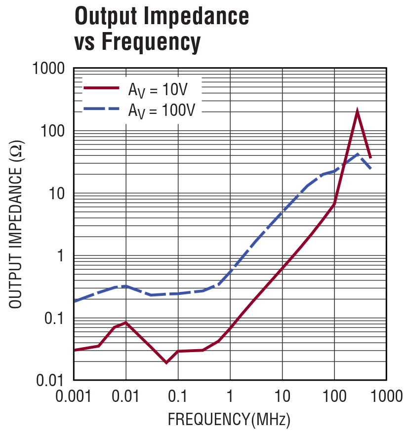

# SiPM transimpedance amplifier into a slight impedance mismatch
We are considering using an [LTC6268-10](https://www.analog.com/media/en/technical-documentation/data-sheets/626810f.pdf)
    at the output of each SiPM to conver their (high-Z) current pulses into
    moderate-Z voltage pulses.
However the output impedance of that amplifier is not exactly 50 ohms across all frequencies:

So this little simulation with an ideal op amp lets us play with changing the output
    impedance and terminating with a 50 ohm resistor.

## Conclusions
- From 0.1-100 ohm output impedance,
    the distortion to the voltage pulse is not appreciable.

- Also: a 10ns delay corresponds to a PCB waveguide of length ~1.5 meters.
We are nowhere near that.
So in real life, distortion effects should be virtually unobservable.
